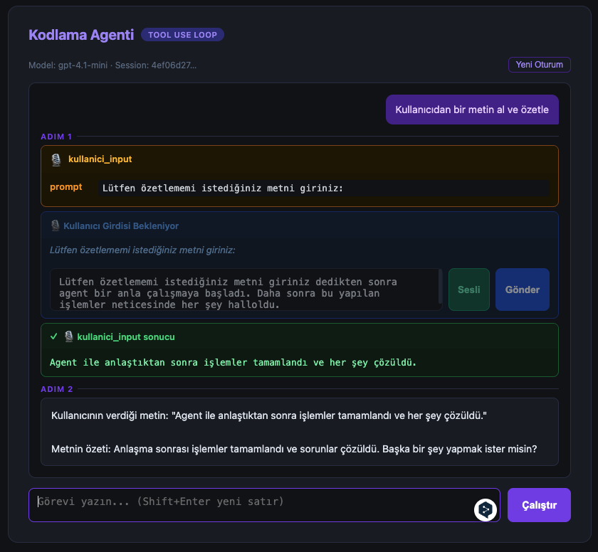

# vbl1

Flask + vanilla JS ile oluşturulmuş üç arayüzlü bir LLM uygulaması.

## Sayfalar

| Sayfa | URL | Açıklama |
|---|---|---|
| LLM Arayüzü | `/` | Tek seferlik, hafızasız LLM çağrısı |
| Asistan | `/asistan` | Conversation history tutan sohbet |
| Kodlama Agenti | `/agent` | Tool-calling agentic loop |

## Kurulum

```bash
python3 -m venv .venv
source .venv/bin/activate
pip install -r requirements.txt
```

`.env` dosyası oluşturun:

```
OPENAI_API_KEY=sk-...
```

Uygulamayı başlatın:

```bash
flask --app app run --debug
```

## Kodlama Agenti Tool'ları

Agent aşağıdaki tool'lara sahiptir:

| Tool | Açıklama |
|---|---|
| `terminal` | Shell komutu çalıştırır (`/tmp/agent_workspace`) |
| `dosya_oku` | Dosya içeriğini okur |
| `dosya_yaz` | Dosya oluşturur veya üzerine yazar |
| `kullanici_input` | Kullanıcıdan yazılı veya sesli input alır, özetler |

### `kullanici_input` Tool'u Nasıl Çalışır?

Agent görev sırasında kullanıcıdan bilgi almaya ihtiyaç duyduğunda `kullanici_input` tool'unu çağırır. Akış şu şekildedir:

1. Agent tool'u çağırır → backend bir `queue` üzerinde bloke bekler
2. Arayüzde mavi bir input kutusu açılır
3. Kullanıcı **metin yazar** veya **Sesli** butonuna basıp konuşur
   - Sesli girişte kayıt durdurulduğunda ses OpenAI Whisper API ile metne çevrilir
4. **Gönder** butonuna basılır
5. Metin backend'e iletilir, LLM ile özetlenir
6. Özet agent'a döner ve loop devam eder


